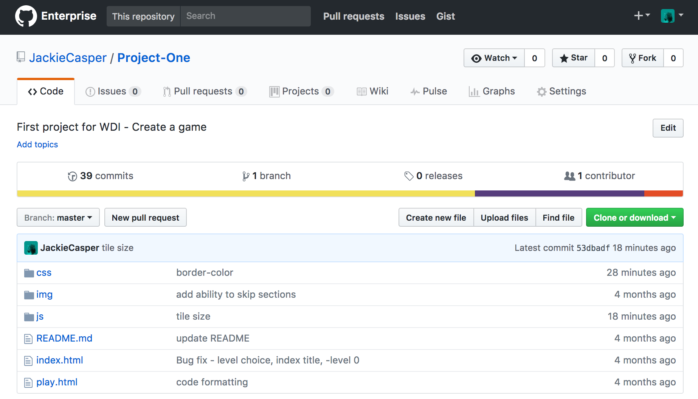
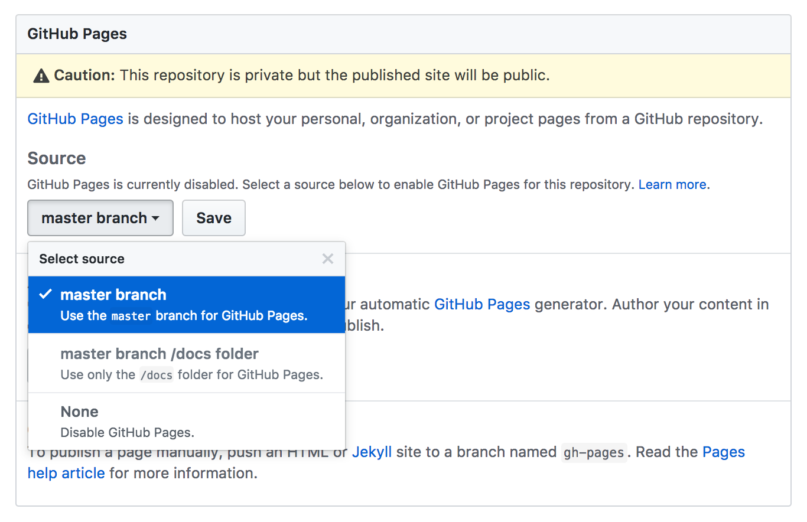
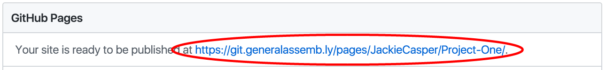

# GitHub Pages! :computer:

**Welcome to your first project deployment guide!**

For project 1 you will be deploying your game using GitHub Pages. Since GitHub is awesome, this is a simple process that takes 5 steps.

---

#### 1. Go to your project repo.

  

  ***Note***
  > Make sure your `index.html` file is within your root directory!

---

#### 2. Navigate to the settings tab.

  

---

#### 3. Scroll to the GitHub Pages section and select your master branch.

  

---

#### 4. Press `save`.

  

---

#### 5. Pat yourself on the back, click on your link and play your game - it is officially on the internet!

  

  ***Note***
  > **Another awesome part of GitHub Pages!** Whenever you now push to master, your GitHub page will be updated!
